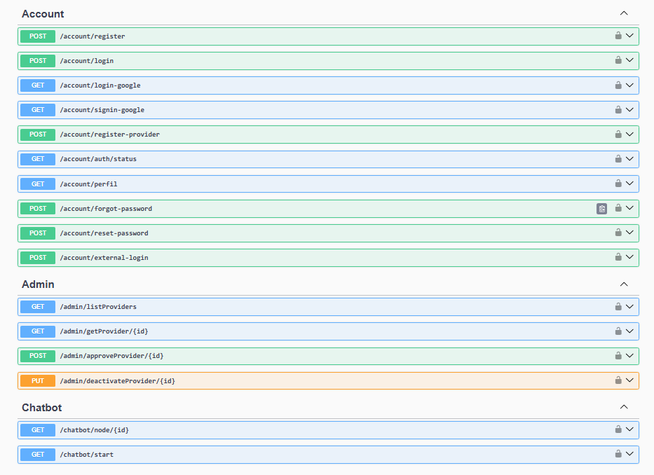
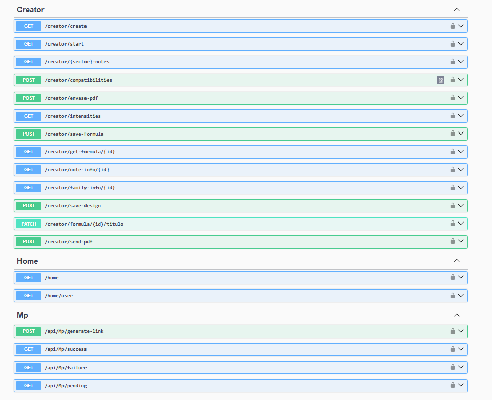
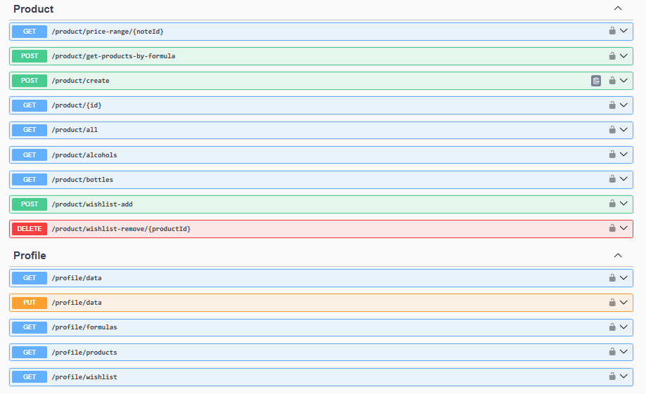
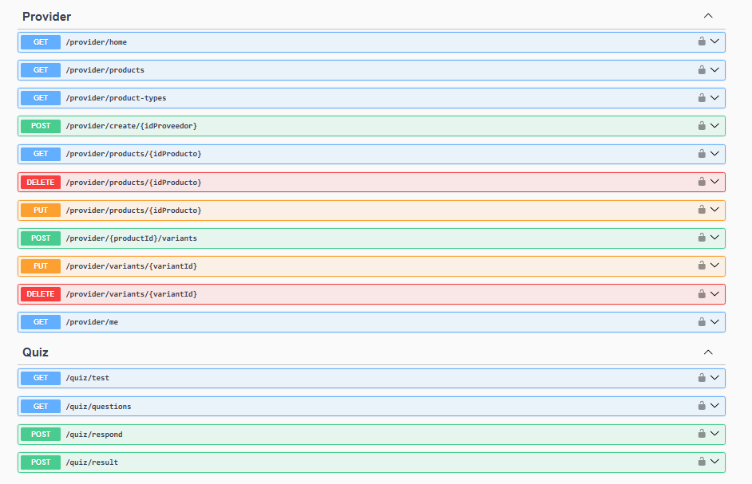

# Documentación DE Alquimia

## URL de la página
https://frontend-alquimia.vercel.app/

## Tecnologías del backend
- C# con ASP.NET Core
- Python, FastAPI
- Moq
- XUnit
- OAuth
- JWT

## Tecnologías del frontend
- Nextjs
- Tailwind
- TypeScript
- Zustand

## Integrantes:
- Gomez, Celeste
- Leguero, Axel
- Moscovich, Celena
- Nuñez, Ana
- Pereyra, Ludmila
- Ponce, Ivan
- Zara, Micaela

## ENDPOINTS

